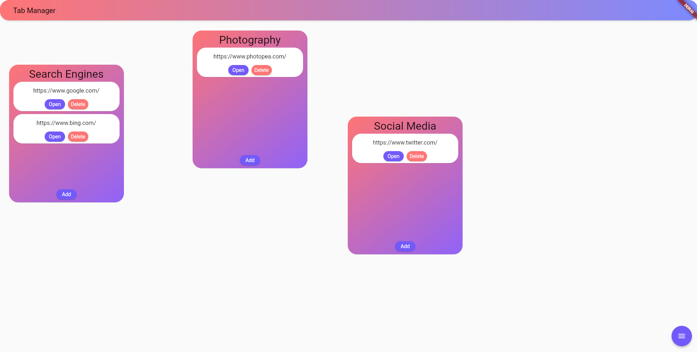
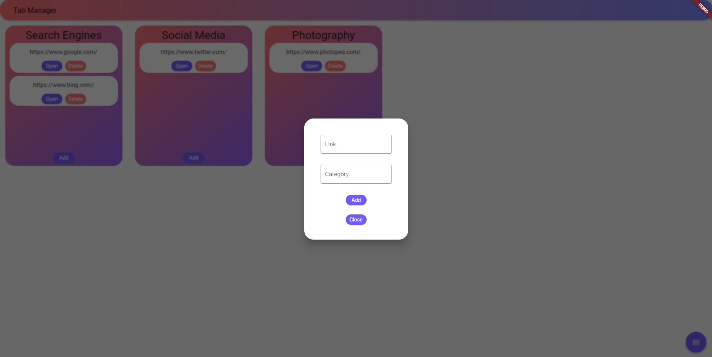

You can contact me here: ahmed.samiul.h@gmail.com

# Tabmanager

Created by Sami-ul

## Recent updates
- Made the app run faster by using the backend to serve the build
- Check `Usage` to know how to use it now

## Info
- A tab manager that uses Postgres, NodeJS, Express, and Flutter
- Boxes are draggable
- Instructions to set up Postgres are in `tabmanager_backend\SQL_Queries`

## Usage
- Build flutter if updated version is not in `tabmanager_backend\flutter_build`
- Navigate to `tabmanager_backend` and run `node .`
- App is open on port 3000
## Required Tools
- Make sure you have the following tools installed
    - Postgres
    - NodeJS
    - Flutter
## Setup
- Deprecated: Use instructions in `usage` instead, still use this for updating
- Updating packages
    - To do this navigate to each folder in server
    - Enter these commands in terminal
        - `cd tabmanager_backend`
        - `npm install`
        - `cd..`
    - Now you have updated packages for poetry and npm
    - We will now update flutter packages
        - Navigate to webapp
        - Assuming you are in summarizationapi:
        - `cd tabmanager_frontend`
        - `flutter pub get`
- Now lets run the app
    - Navigate to each folder in server to start the backend
        - I have not hosted the api anywhere yet so thats why we need to do this(I am only using this for personal use plus database was designed with only localhost in mind)
        - `cd tabmanager_backend`
        - `node .`
    - Now we can start the frontend
        - Use a **separate terminal**
        - `cd tabmanager_frontend`
        - `flutter run -d Chrome --release --web-port=5000`
    - Now the app will start

## Running release
- `flutter build web --release -v` in root
- Edit `/build/web/index.html`, replace line `<base href="/">` with `<base href="/web/">`
- Copy localhost.py into `/build/web/`